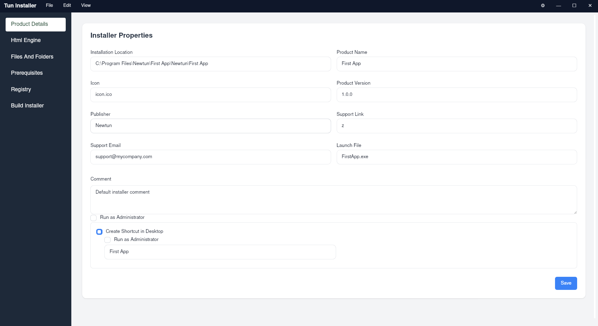

# 🚀 Tun Installer

<p align="center">
  
</p>

<p align="center">
  <strong>Modern Windows EXE Installer Builder powered by HTML & CSS UI</strong>
</p>

---

## 📌 Introduction

**WebInstaller Builder** is a tool for generating Windows `.exe` installers with a modern approach:  
the installer interface is built entirely using **HTML and CSS** instead of traditional native UI components.

This allows developers to:

- 🎨 Fully customize the installer UI
- 🌐 Use HTML + CSS
- 🧩 Easily extend and maintain installer layouts
- ⚡ Build professional installers faster

In addition to flexible UI customization, the tool supports all core features expected from a professional installer system.

---

📚 **Documentation & User Guide:**  
For detailed usage instructions, configuration examples, and advanced guides, please visit:

👉 **[Documents - User Guide](DOCUMENT.md)**

---

## ✨ Key Features

- 🖥 Generate Windows `.exe` installer packages
- 🎨 HTML + CSS powered installer UI
- ⚙️ Configure application metadata:
    - Application name
    - Version
    - Publisher
    - Icon
- 📦 Bundle application resource files
- 🧰 Install additional prerequisites (e.g. runtime dependencies)
- 🗂 Add or modify Windows Registry entries
- 📁 Custom installation directory
- 🧾 Config-based installer generation

---

## 🖼 Tool Interface

> Add screenshots to the `docs/` folder and update paths below.

<p align="center">
  
</p>

The interface is designed to be intuitive, developer-friendly, and flexible for customization.

---

## 🏗 Architecture Overview

WebInstaller Builder consists of two main layers:

### 1️⃣ Installer Engine

- Handles installation logic
- Copies application files
- Executes prerequisites
- Writes registry entries
- Generates final `.exe` output

### 2️⃣ Web UI Layer

- Built using HTML & CSS
- Fully customizable layout and themes
- Separate from installation logic
- Easy to maintain and extend

---

## 🧪 Development Setup

### ✅ Prerequisites (Required Frameworks)

- Windows 10 or Windows 11 or Linux
- [Tauri](https://v2.tauri.app/)
- [Angular](https://angular.dev/)
- [Node.js v24.11.0](https://nodejs.org/en)

### First-time Setup

```bash
git clone https://github.com/VinhTin-AQUA/tun-installer.git
cd tun-installer
npm install
npm run build-all-lib
```

### Development Workflow

```bash
# Run Installer Builder
npm run tauri:dev:builder

# Build Installer Builder
npm run tauri:build:builder

# Build Exe template
npm run tauri:build:template
```

### Test Exe Template without build Exe Template

- In **projects\installer-template\src-tauri\src\bootstrapper\bootstrapper.rs**, change **temp_app_dir** to tun-installer project path

- In **libs\rust\helpers\src\file_helper.rs**
  change **exe_path_buf** to compressed exe file before

### Build Tun Installer

```bash
build_window.bat
```

- Exe Path: tun-installer\target\release\bundle\nsis\Tun Installer_0.1.0_x64-setup.exe

### Dev commands

- Angular commands

    ```bash
    # create project
    ng new my-workspace --create-application=false
    cd my-workspace
    ng generate application app1
    ng generate application app2

    # create lib
    ng g library data-access --project-root=libs/angular/data-access;

    # build lib
    ng build shared-lib

    # run project
    ng s installer-template

    # create component in lib
    ng g component components/button --project=shared-lib
    ng g s tauri-command-service --project=tauri
    ```

- Cargo commands

```bash
# run project
cargo run -p installer_builder
npm run dev:installer:builder

# run project with args  -- --debug-mode --channel beta --env production

# Run project with npx
cd projects/installer-builder/src-tauri && npx tauri dev

# Build tauri with npx
cd projects/installer-builder/src-tauri && npx tauri build --no-bundle --target x86_64-pc-windows-msvc

# create crate lib
cargo new shared-lib --lib

```

- Window scripts

```bash
# run exe with args
exe_template_v1.0.0.exe --status uninstall
```

## Other resource

### rcedit-x64.exe

- Edit resource in exe file. I use it to change exe icon
- link: https://github.com/electron/rcedit

## Upcoming Features

- CLI Support (Coming Soon)
- CI/CD Integration

## 📄 License

GNU GENERAL PUBLIC LICENSE
